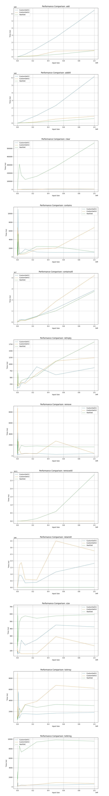

# Set
Implementation of a Set using a Map. This was based off of my initial version using an array: https://github.com/bk10aao/CustomSet

# Methods
1. `CustomSet()` - default constructor.
2. `CustomSet(final Collection<T> c)` - create set with items from given collection, throws NullPointerException on null collection.
3. `CustomSet(final int initialCapacity)` - create a set with a given capacity, throws IllegalArgumentException on negative size.
4. `CustomSet(final int initialCapacity, final double loadFactor)` - create a set with a given capacity and load factor, throws IllegalArgumentException on negative size or load factor less than 0 or larger than 1.
5. `boolean add(final T item)` - adds item to set if not currently present. Returns true if not already present in Set. 
6. `boolean addAll(final Collection<T> c` - adds all items in collection to set. Throws NullPointerException on null item in set. Returns true if set is modified. 
7. `void clear()` - clears the set back to an empty state.
8. `boolean contains(final T item)` - returns boolean determining if set contains item. 
9. `boolean containsAll(final Collection<T> c)` - returns boolean determining if all items in collection are contained within Set. Throws NullPointerException if collection contains null item.
10. `boolean isEmpty()` - returns boolean determining if set is empty. 
11. `boolean remove(final T item)` - returns boolean determining if value existed and removed from set.
12. `boolean removeAll(final Collection<T> c)` - removes all items from set in collection. Returns true if Set is modified.
13. `boolean retainAll(final Collection<T> c)` - retains all items from set in collection and removes all others. Returns true if Set is modified.
14. `int size()` - returns size of Set as Integer.
15. `T[] toArray()` - returns values in set as Array.
16. `String toString()` - returns String representation of Set.

<br/>

## Performance Complexity
|          Method         | CustomSet V1 (LinkedList) | CustomSet V2 (HashMap) |     Java HashSet     |         Winner         |
|:-----------------------:|:-------------------------:|:----------------------:|:--------------------:|:----------------------:|
| add(T)                  | O(n)                      |  O(1) avg, O(n) worst  | O(1) avg, O(n) worst | CustomSet V2 & HashSet |
| addAll(Collection)      | O(n * m)                  |          O(m)          |         O(n)         | CustomSet V2 & HashSet |
| clear()                 | O(1)                      |          O(1)          |         O(1)         | Tie                    |
| contains(T)             | O(n)                      |          O(1)          |         O(1)         | CustomSet V2 & HashSet |
| containsAll(Collection) | O(n * m)                  |          O(m)          |         O(n)         | CustomSet V2 & HashSet |
| isEmpty()               | O(1)                      |          O(1)          |         O(1)         | Tie                    |
| remove(T)               | O(n)                      |          O(1)          |         O(1)         | CustomSet V2 & HashSet |
| removeAll(Collection)   | O(n * m)                  |          O(m)          |         O(n)         | CustomSet V2 & HashSet |
| retainAll(Collection)   | O(n * m)                  |          O(n)          |         O(n)         | CustomSet V2 & HashSet |
| size()                  | O(1)                      |          O(1)          |         O(1)         | Tie                    |
| toArray()               | O(n)                      |          O(n)          |         O(n)         | Tie                    |
| toString()              | O(n)                      |          O(n)          |         O(n)         | Tie                    |
<br/>

## Space Complexity
|          Method         |  CustomSet V1 (LinkedList)  | CustomSet V2 (HashMap) | Java HashSet |         Winner         |
|:-----------------------:|:---------------------------:|:----------------------:|:------------:|:----------------------:|
| add(T)                  | O(n) + chaining overhead    |          O(n)          |     O(n)     | CustomSet V2 & HashSet |
| addAll(Collection)      | O(n + m)                    |        O(n + m)        |   O(n + m)   | Tie                    |
| clear()                 | O(1)                        |          O(1)          |     O(1)     | Tie                    |
| contains(T)             | O(1) per bucket, O(n) worst |          O(1)          |     O(1)     | CustomSet V2 & HashSet |
| containsAll(Collection) | O(n * m)                    |          O(m)          |     O(m)     | CustomSet V2 & HashSet |
| isEmpty()               | O(1)                        |          O(1)          |     O(1)     | Tie                    |
| remove(T)               | O(1) per bucket, O(n) worst |          O(1)          |     O(1)     | CustomSet V2 & HashSet |
| removeAll(Collection)   | O(n * m)                    |          O(m)          |     O(m)     | CustomSet V2 & HashSet |
| retainAll(Collection)   | O(n * m)                    |          O(n)          |     O(n)     | CustomSet V2 & HashSet |
| size()                  | O(1)                        |          O(1)          |     O(1)     | Tie                    |
| toArray()               | O(n)                        |          O(n)          |     O(n)     | Tie                    |
| toString()              | O(n)                        |          O(n)          |     O(n)     | Tie                    |


# Performance Testing

The following charts were geenrated using the following values, this was ran 5 times with the average of these runs used to plot the performance:
```
1, 10, 50, 100, 250, 500, 750, 1000, 2500, 5000, 7500, 10000, 25000, 50000, 100000, 250000, 500000, 750000, 1000000
```

Larger values were tested for Version 1 and Version 2 but when testing HashSet with those it became very slow and have therefore been scaled down. This happened predominantely by the method `removeAll` suggesting that this is caused by the HashSet resizing". 

These values and seperate charts comparing each can be found in the [CompareAll Performance Charts](https://github.com/bk10aao/CustomSetV2/tree/main/PerformanceTesting)
 directory.


